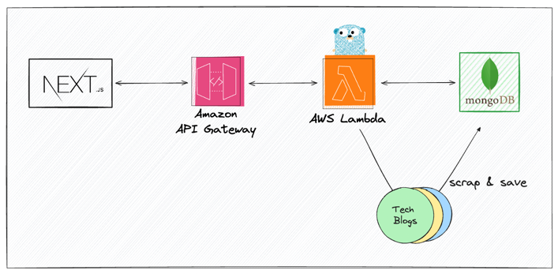

# blog-gopher

### 개요
- 다양한 회사에서 자체적으로 운영하는 기술블로그를 모아볼 수 있는 서비스를 제공합니다.

### Service Architecture

### Tech Stacks
- Go v1.21
- Gin v1.10
- Goquery v1.9.2
- MongoDB

### API
- [X] GET `/posts` : 블로그 전체 조회
- [X] GET `/search` : 블로그 검색
- [ ] POST `/posts/save` : 블로그 저장

### Scrapping Blogs
- [X] 당근
- [X] 토스
- [X] 버즈빌
- [X] 무신사
- [X] 29cm
- [X] 올리브영
- [X] 카카오페이
- [X] 컬리
- [X] 카카오뱅크
- [X] 데브시스터즈
- [X] 오늘의집
- [X] 라인
- [X] 쏘카
- [ ] 화해
- [ ] 크몽
- [ ] AWS KR
- [ ] 리디

### Main Feature
- Tech blog scrapper
- Check read article(blog)
- Categorizing by corp
- Bookmark article

### Todo 
- [X] goroutine
- [X] Date Parsing
- [X] repository
- [X] search
- [X] web framework
- [X] default toggle
- [ ] scheduler per day

### 어떤 문제를 해결하려고 하는건지, 혹은 어떤 기술적 어려움이 있는지.
- 읽은 블로그를 체크하고 싶다. -> 인증/인가 필요 (github)
- 자주 보는 아티클을 별도로 저장하고 싶다.
- 블로그 스크래핑을 10초 내로 완료하고 싶다.
- 나만 사용할 수 있는 기능 -> 블로그 저장/읽음 표시
- 텍스트 전문 검색 기능